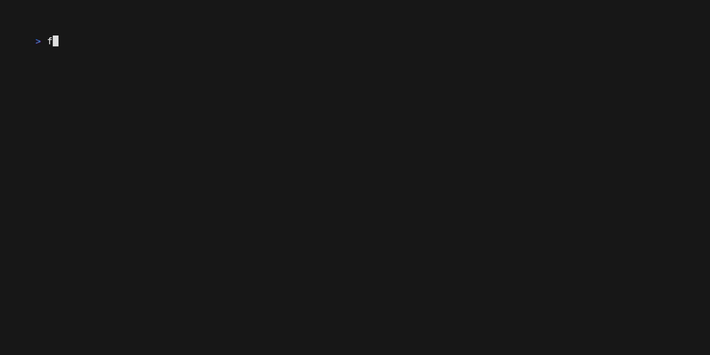

# F1Term 🚦🏎️

**F1Term** is a terminal-based application that brings the trhill of live Formula 1 sessions to your terminal. Whether it's Free Practice, Qualifying, or the Race, stay updated with live data in a sleek and responsive text-based interface.



## 🌟 Features
- **Live Session Results**: Watch live standings and updates for any session during a race weekend.
- **User-Friendly TUI**: Navigate an intuitive Text User Interface built with the [Bubble Tea](https://github.com/charmbracelet/bubbletea) framework.
- **API Integration**: Powered by the [OpenF1 API](https://openf1.org/#introduction) to deliver accurate, real-time updates.
- **Lightweight & Efficient**: Runs directly in your terminal with minimal system requirements

## 🚀 Getting Started
### Prerequisites
- Go (Golang) installed on your system

### Installation
**Option 1: Install with** `go install`
```bash
go install github.com/JakobLybarger/F1Term@latest
```
This will download and build the binary directly into your $GOPATH/bin. Ensure $GOPATH/bin is in your system's PATH:
```bash
export PATH=$PATH:$(go env GOPATH)/bin
```
Run the application with:
```bash
formula
```

**Option 2: Clone and Build**
1. Clone the repository:
```bash
git clone https://github.com/JakobLybarger/F1Term.git
cd F1Term
```
2. Build the application:
```bash
go build -o formula
```
3. Run
```bash
./formula
```

## 🛠️ Development
F1Term is built with:
- Language: [Golang](https://go.dev/)
- TUI Framework: [Bubble Tea](https://github.com/charmbracelet/bubbletea)
- API: [OpenF1](https://openf1.org/#introduction)

Feel free to contribute!
1. Fork the repository
2. Create a feature branch
```bash
git switch -c feature/your-feature-name
```
3. Commit your changes and open a pull request.

## 🌍 Community
Have questions, ideas, or just want to say hi? Open an issue or reach out!
